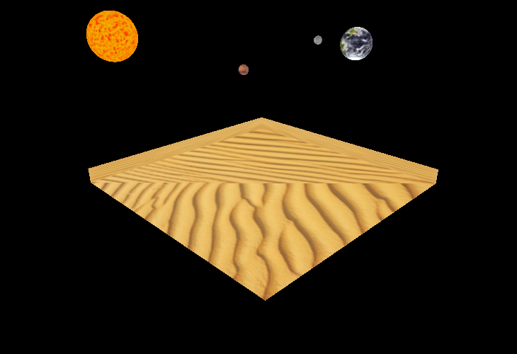
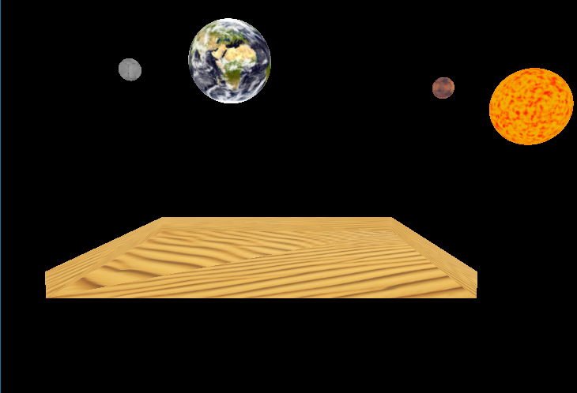
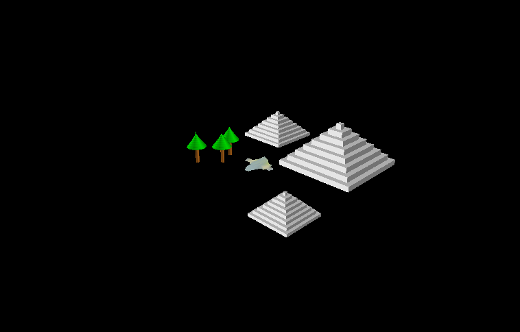
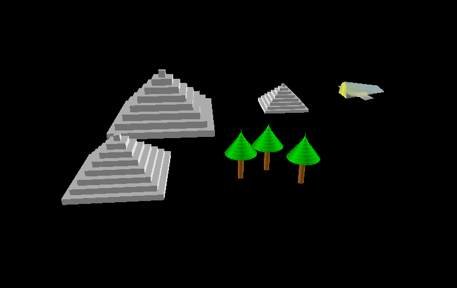

# CG-Cosmic-Desert
Computer graphics ships in cosmic desert simulation. Created at the University as the project within Computer Graphics classes in 2014. The purpose of this project was to learn and understand how computer graphics and simple animations work. The world of the project is based on freeGLUT engine.

## App
App allows to fly cosmic ship by keyboard and control cosmic space by moving world's camera. The world is based on freeGlut library and shows basic of computer graphics operations.

### Screenshots
Screenshots dividing world in two parts. For more see [screenshots](screenshots) folder. There are also videos.

   
